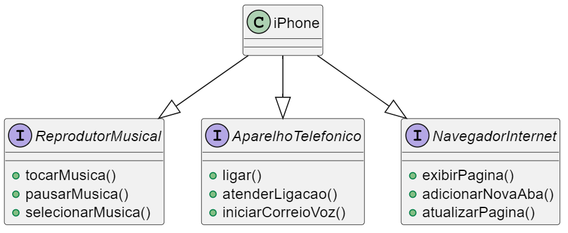

Dio - Santander Bootcamp 2023 - Backend Java - Desafios 

Desafio Proposto = POO

Modelagem e diagramação da representação em UML e Código no que se refere ao componente iPhone.

Com base no vídeo de lançamento do iPhone conforme link abaixo, elabore em uma ferramenta de UML de sua preferência a diagramação das classes e interfaces com a proposta de representar os papéis do iPhone de: Reprodutor Musicial,  Aparelho Telefônico e Navegador na Internet. Em seguida crie as classes e interfaces no formato de arquivos .java

[Lançamento iPhone 2007](https://www.youtube.com/watch?v=9ou608QQRq8)

###### Comportamentos esperados:
* Repodutor Musicial: tocar, pausar, selecionarMusica
* Aparelho Telefônico: ligar, atender, iniciarCorrerioVoz
* Navegador na Internet: exibirPagina, adicionarNovaAba, atualizarPagina

Diagrama desenvolvido por mim:

